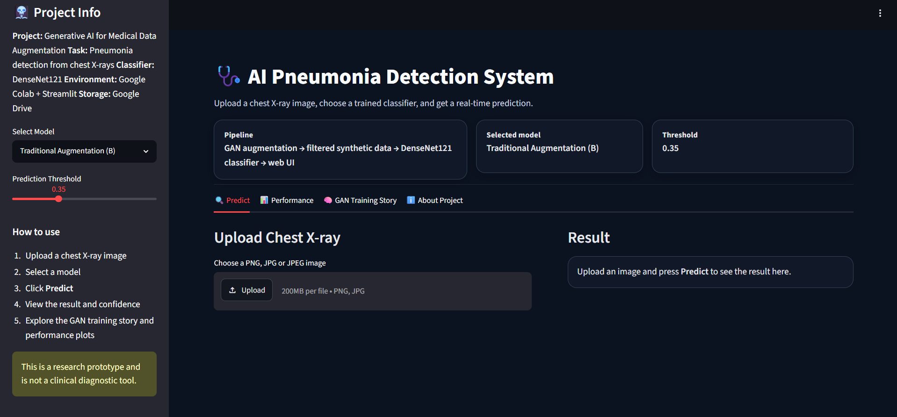
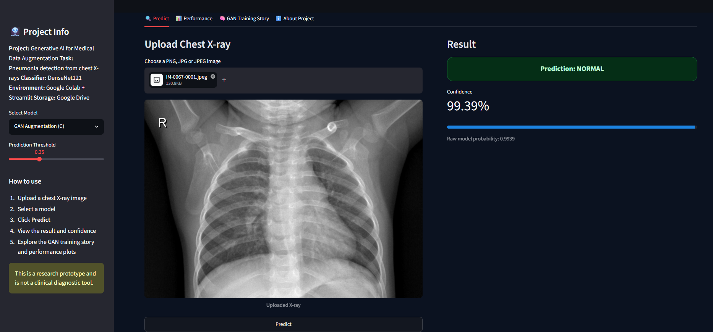
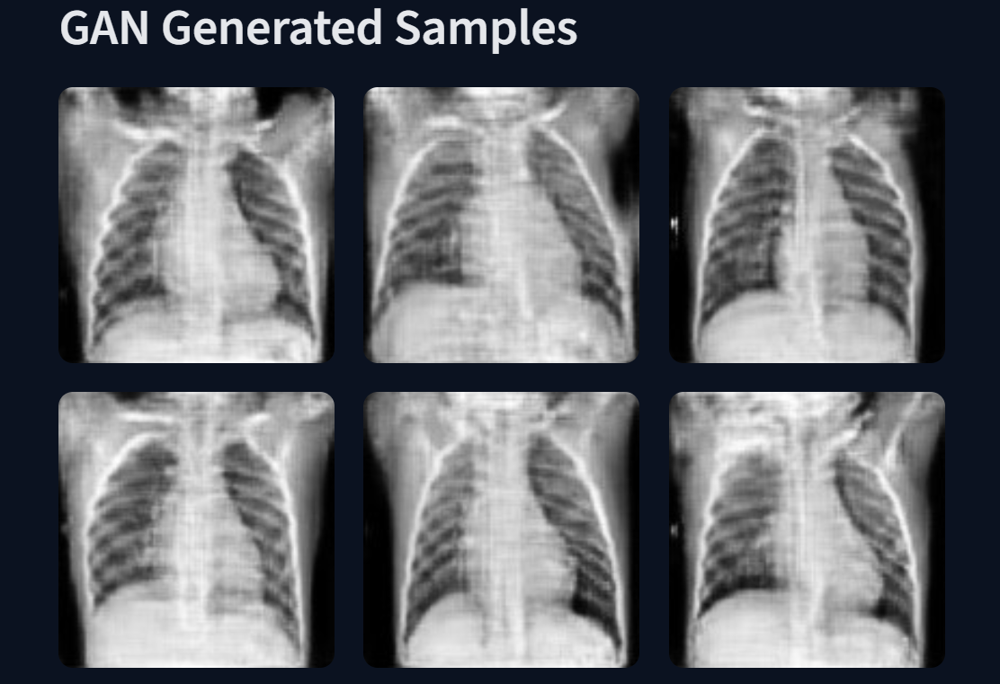
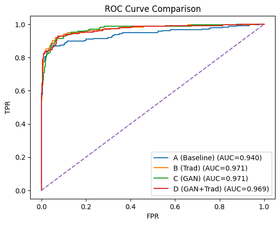
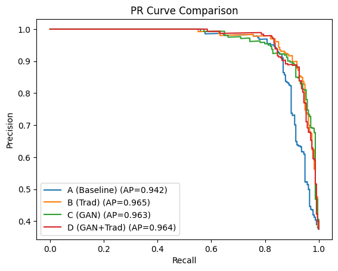
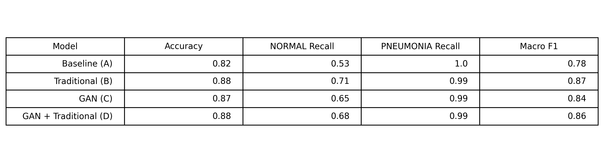

#  Generative AI for Medical Data Augmentation and Pneumonia Detection

This project explores the use of **Generative AI** for medical image augmentation and its impact on pneumonia detection from chest X-ray images.

A **WGAN-GP (Wasserstein GAN with Gradient Penalty)** is trained on NORMAL chest X-ray images to generate synthetic samples. These generated images are then filtered using **DenseNet121 feature similarity** before being used for classifier training.

The project also includes an interactive **Streamlit-based UI** for real-time pneumonia prediction and model comparison.

---

## Table of Contents
- [Overview](#overview)
- [Problem Statement](#problem-statement)
- [Objectives](#objectives)
- [Dataset](#dataset)
- [Methodology](#methodology)
- [Model Architecture](#model-architecture)
- [Results](#results)
- [UI Demo](#ui-demo)
- [Technologies Used](#technologies-used)
- [Project Structure](#project-structure)

---

## Overview

Medical datasets are often **small and imbalanced**, which makes training reliable deep learning models difficult.

This project investigates whether synthetic chest X-ray images generated using GANs can improve the performance of pneumonia classification models.

The pipeline includes:

1. Training a **WGAN-GP** on NORMAL chest X-ray images  
2. Generating synthetic chest X-ray images  
3. Filtering low-quality synthetic images using **DenseNet121 features**  
4. Training a **DenseNet121 classifier**  
5. Comparing multiple augmentation strategies  
6. Deploying a **Streamlit UI** for prediction and demonstration  

---

## Problem Statement

Chest X-ray datasets used for pneumonia detection are often imbalanced, with fewer NORMAL samples than PNEUMONIA samples.

This imbalance can bias classifiers and reduce model reliability.

The project aims to solve this problem using:
- Generative AI
- Synthetic data augmentation
- Feature-based filtering
- Deep learning-based classification

---

## Objectives

- Train a stable **WGAN-GP** model for chest X-ray generation
- Generate realistic synthetic **NORMAL** X-ray images
- Filter synthetic images using **DenseNet121 feature similarity**
- Train and evaluate a **DenseNet121 classifier**
- Compare:
  - Baseline (no augmentation)
  - Traditional augmentation
  - GAN augmentation
  - GAN + traditional augmentation
- Build an interactive **Streamlit application**

---

## Dataset

The project uses the **Chest X-ray Pneumonia dataset** from Kaggle.

### Classes
- `NORMAL`
- `PNEUMONIA`

### Preprocessing
- Resize images to `128 x 128`
- Convert to grayscale
- Normalize to `[-1, 1]`

---

## Methodology

### 1. GAN Training
A **WGAN-GP** is trained only on NORMAL chest X-ray images to learn the distribution of healthy X-rays.

### 2. Synthetic Image Generation
The trained generator produces synthetic NORMAL chest X-ray images from random noise.

### 3. Filtering
Generated images are evaluated using **DenseNet121 feature embeddings**, and only the most realistic samples are retained.

### 4. Classifier Training
A **DenseNet121** classifier is trained under four settings:
- Baseline
- Traditional augmentation
- GAN-only augmentation
- GAN + traditional augmentation

### 5. Evaluation
The models are evaluated using:
- Accuracy
- Precision
- Recall
- F1-score
- ROC-AUC
- Precision-Recall curves

---

## Model Architecture

### Generative Model
- **WGAN-GP**
- Generator
- Critic / Discriminator
- Gradient Penalty
- Feature Matching
- Perceptual Guidance

### Classification Model
- **DenseNet121**
- Adapted for grayscale input
- Binary classification: NORMAL vs PNEUMONIA

---

## Results

### Ablation Study

| Model | Accuracy | NORMAL Recall | PNEUMONIA Recall | Macro F1 |
|------|----------|---------------|------------------|----------|
| Baseline (A) | 0.82 | 0.53 | 1.00 | 0.78 |
| Traditional Augmentation (B) | 0.88 | 0.71 | 0.99 | 0.87 |
| GAN Augmentation (C) | 0.87 | 0.65 | 0.99 | 0.84 |
| GAN + Traditional (D) | 0.88 | 0.68 | 0.99 | 0.86 |

### Key Findings
- GAN augmentation improved performance compared to the baseline model.
- Traditional augmentation achieved the highest overall performance in this dataset.
- GAN-generated images provided useful additional training data.
- Hybrid augmentation produced competitive results.

---

## UI Demo

The project includes a **Streamlit application** that allows users to:

- Upload a chest X-ray image
- Select a trained model
- Predict `NORMAL` or `PNEUMONIA`
- View confidence scores
- See ROC and Precision-Recall curves
- Explore GAN-generated sample images

---

## Screenshots

### Web Application


### Prediction Example


### GAN Generated Samples


### ROC Curve


### Precision-Recall Curve


### Confusion Matrix
.png)

### Ablation Study


---

## Technologies Used

- Python
- PyTorch
- Torchvision
- DenseNet121
- WGAN-GP
- Streamlit
- Scikit-learn
- NumPy
- Pandas
- Matplotlib
- Seaborn
- Google Colab
- Google Drive

---

## Project Structure

```text
Generative-AI-Medical-Augmentation/
│
├── notebooks/
│   └── Gen_AI.ipynb
│
├── app/
│   ├── app.py
│   ├── model_utils.py
│   └── requirements.txt
│
├── screenshots/
│   ├── ui_home.png
│   ├── prediction.png
│   └── gan_samples.png
│
├── results/
│   ├── roc_combined.png
│   ├── pr_combined.png
│   ├── confusion_matrix.png
│   └── ablation_results.png
│
└── README.md
